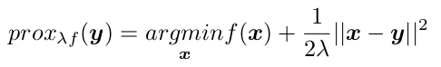
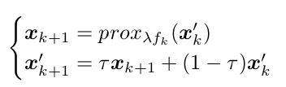
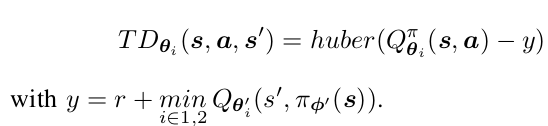
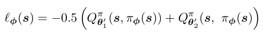
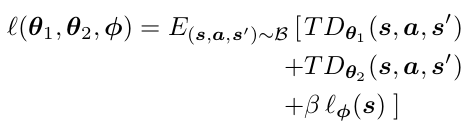
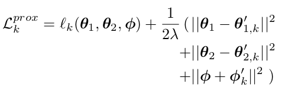

# Title : Proximal Deterministic Policy Gradient

# Author: Marco Maggipinto , Gian Antonio Susto and Pratik Chaudhari(2019)
### Filiation: None
### Publication at: arxiv
Link [Proximal Deterministic Policy Gradient][https://arxiv.org/abs/2008.00759]

#### Abstract

"This paper introduces two simple techniques to improve off-policy Reinforcement Learning (RL) algorithms. First, we formulate off-policy RL as a stochastic proximal point iteration. The target network plays the role of the variable of optimization and the value network computes the proximal
operator. Second, we exploits the two value functions commonly employed in state-of-the-art off-policy algorithms to provide an improved action value estimate through bootstrapping with limited increase of computational resources. Further, we demonstrate significant performance improvement over state-of-theart algorithms on standard continuous-control RL benchmarks."

#### General Content

- Proposes an alternative optimization procedure
    - Tackles sample efficiency problem
    - Principled interpretation of target nets
    - Minimizes a single loss function combining policy and value updates
- Time Damped Stochastic Proximal Gradient
- TD3 + Proximal gradient Optimization
- Exploit 2 Q-nets

#### Key take-aways

- 

- Uses x'k+1 as target networks an xk+1 as actual networks.
- Introduces lambda and tau parameters to give more freedom to tune the algorithm behavior
- lambda controls how close the x and x' are. Is the analogous to update speed in target nets.
- One Policy and two Action Value Networks.
- Uses target for both policy and action value networks.

- Uses smooth-L1 for smoother training instead of MSE
- Policy Network trained to maximize average action value of the two target Q-functions

- Differences between TD3 and PDPG
    - Target networks used to compute policy gradients instead of their "fast" counterpart
    - A bootstrapped estimate of the action value leverages both the the available Q-networks to reduce the approximation error.
- The resulting methods thus performs SPI on a single loss function l(θ, φ):

- Uses clipped noise to smooth the action value functions. (Normal distribution)
- Applies n_prox gradient descent steps to minimize the proximal loss defined as:

* Results:
    * Outperforms: SAC, TD3, PPO
    * More unstable than the three compared algorithms 

* Conclusion:
"In this paper we proposed Proximal Deterministic Policy Gradient, an off-policy RL method for model free continuous control tasks that exploits proximal gradient methods and bootstrapping to better solve the TD error optimization problem. Proximal algorithms are appealing in an RL setting
since they show improved convergence and stability properties compared to standard SGD. Moreover, we showed that proximal methods provide a natural interpretation of the target networks, a trick commonly employed in RL to stabilize training. The resulting algorithm compare favourably with state-of-the-art off-policy and on-policy methods showing improved sample efficiency and asymptotic performance. The significant increase in sample efficiency makes our algorithm appealing for deployment in real environments, this possibility will be explored in a future work."

* Future Work:
    - Check on real environments

#### Keypoints

- Optimization of TD3 tackling sample efficiency
- Uses Stochastic Proximal Iteration to substitute target networks
- A shared loss function for both Policy and Action Value networks
- Introduces lambda and tau as new hyperparameters

#### Observations and Questions

- The strength of the target model (lambda) or the damping constant (tau) could be a regression just like SAC's alpha parameter?
    - Mainly the damping constant
- Introducing temperature constant just like in SAC would it be good?

